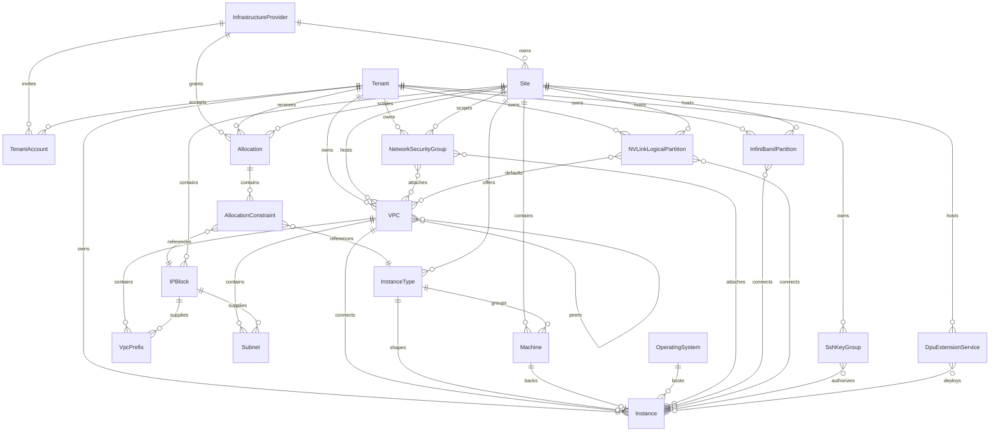

# API Resource Overview

The diagram below shows the main top-level API resources returned by the REST API and the most important ownership or dependency relationships between them. It is intentionally selective: certain resources are omitted so the core Provider, Tenant, Site, network, compute, and Instance lifecycle remains readable.

